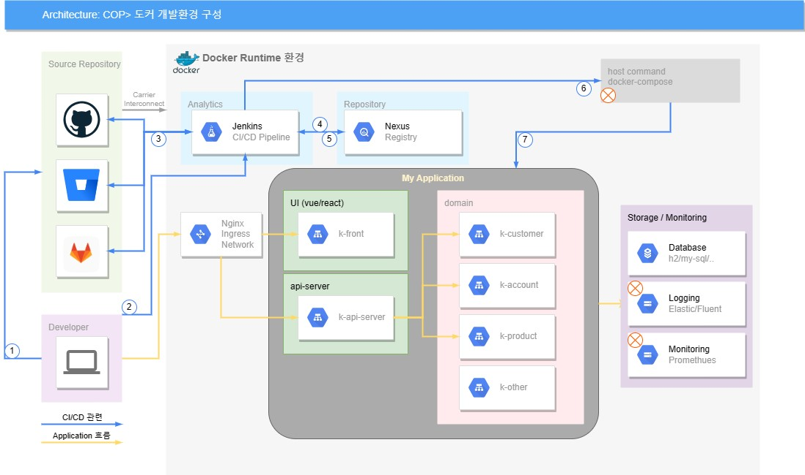
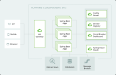
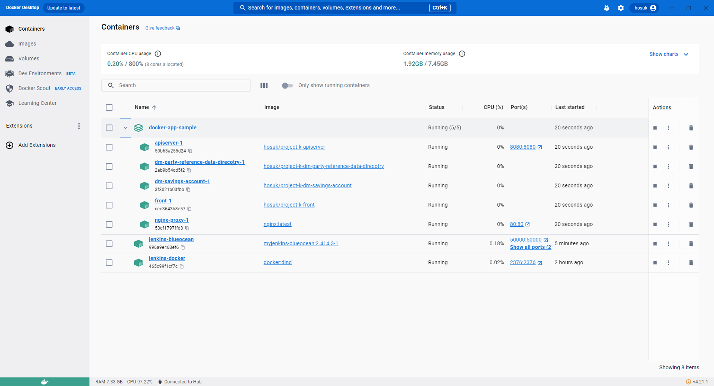
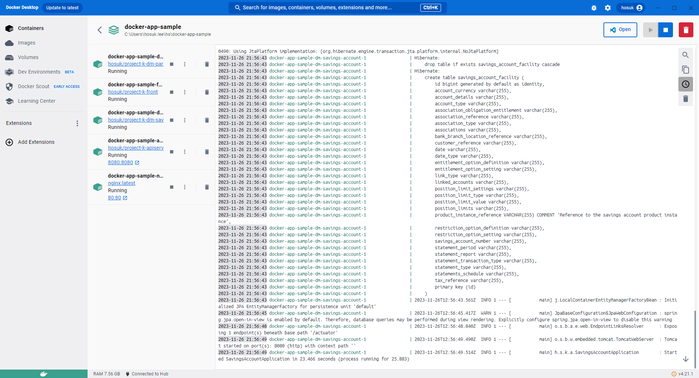
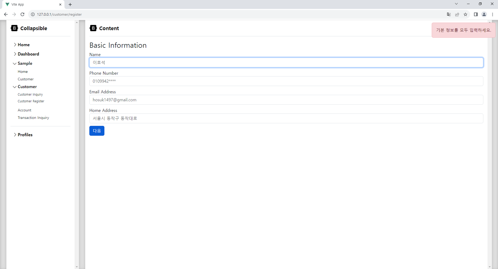
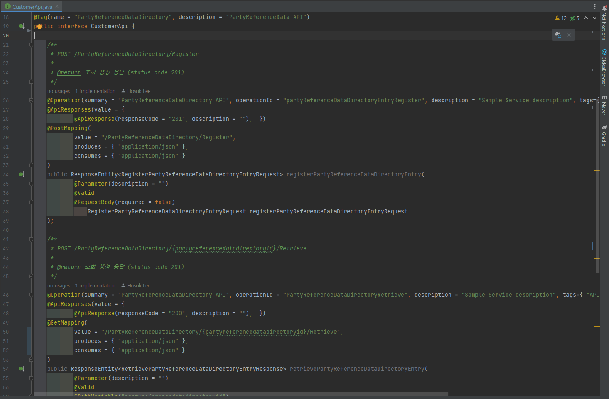
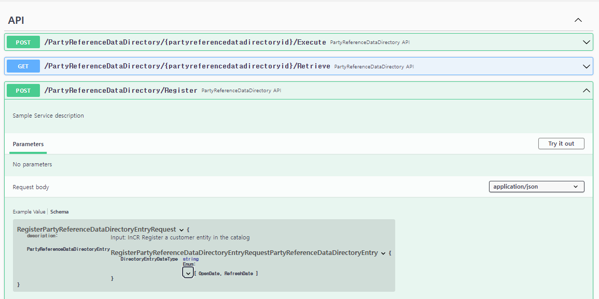
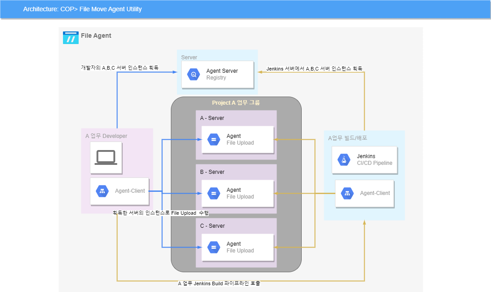

= Dockerizing Project Develop 문서
Hosuk Lee <hosuk@kbfg.com>
3.0, July 01, 2023: AsciiDoc article template
:toc:
// :icons: font
// :url-quickref: https://docs.asciidoctor.org/asciidoc/latest/syntax-quick-reference/

Content entered directly below the header but before the first section heading is called the preamble.

== 1. Local 개발환경
=== 1-1. 개발 IDE

[cols="2,2"]
|===
| IDE | 설명
| Visual Studio Code | DockerFile 및 Vue.js 코드 편집을 위한 통합 개발 환경
| IntelliJ IDEA | Java Spring Boot 코드 편집을 위한 강력한 통합 개발 환경
|===

=== 1-2. 개발 언어 및 도구

[cols="2,2"]
|===
| 언어/도구 | 설명
| Node.js | Frontend 개발을 위해 사용(npm 패키지 관리, vue 설치)
| Docker | 학습환경으로 Docker Desktop을 설치하면 자동으로 설치됨
|===

=== 1-3. 테스트 도구

* Postman
API 테스트를 위한 Postman 도구가 사용되고 있습니다.


== 2. 도커라이징 실습환경

[.caption]
.2. 도커 개발환경 구성
1. 파란색 선은 개발자의 코드 개발 소스코드 배포, 빌드의 CI/CD 과정을 나타낸 것이다.
2. 노란색 선은 개발 시 어플리케이션의 흐름을 표시했다.
- (X)로 2023년 COP에서 학습하지 못함.

=== 2-1. Spring MSA 아키텍처와 비교

- 그림 2와 Spring 에서 소개하는 MSA는 크게 다르지 않음.

=== 2-2. 실습결과 (Docker 실행 확인)

- 실습



- Docker Logs 확인



== 3. 프로젝트 설명
- 프로젝트 소스
* https://github.com/Hosuk-Lee/docker-app-sample.git
```
docker-app-sample
├── nginx-proxy
├── database (h2 or postgresql)
├── front
├── api-server
├── dm-party-reference-data-direcotry
├── dm-product-directory
└── dm-savings-account
```

=== 3-1. nginx-proxy
이 부분은 Nginx 서버의 가상 호스트 설정 중 하나로, 주로 프록시 서버로의 요청을 다른 서비스로 전달하는 역할을 합니다. 여기에서 주목해야 할 몇 가지 중요한 섹션이 있습니다:

.1 **`listen 80;`**
- 포트 80에서 들어오는 요청을 수락합니다. 이는 일반적으로 HTTP 트래픽을 처리하는 데 사용되는 기본 포트입니다.

.2 **프론트엔드 앱에 대한 프록시 설정:**
- `/` 경로로 들어오는 모든 요청은 `http://docker-front`로 프록시됩니다.
- `proxy_redirect off;`는 프록시 서버로의 리디렉션을 비활성화합니다.
- `proxy_set_header`는 프록시 요청에 추가할 HTTP 헤더를 설정합니다. 주로 원본 요청의 정보를 유지하기 위해 사용됩니다.
```nginx
location / {
    proxy_pass         http://docker-front;
    proxy_redirect     off;
    proxy_set_header   Host $host;
    proxy_set_header   X-Real-IP $remote_addr;
    proxy_set_header   X-Forwarded-For $proxy_add_x_forwarded_for;
}
```


.3 **API 서버에 대한 프록시 설정:**

- `/api` 경로로 들어오는 요청은 `http://docker-apiserver`로 프록시됩니다.
- `rewrite` 지시문은 요청에서 `/api` 부분을 제거하여 내부적으로 다른 경로로 보내는 역할을 합니다.
```nginx
location /api {
    rewrite ^/api(/.*)$ $1 break; # /api 부분을 제거합니다.
    proxy_pass         http://docker-apiserver;
    proxy_redirect     off;
    proxy_set_header   Host $host;
    proxy_set_header   X-Real-IP $remote_addr;
    proxy_set_header   X-Forwarded-For $proxy_add_x_forwarded_for;
}
```
이러한 설정은 Nginx를 사용하여 다양한 경로의 요청을 서로 다른 서비스로 프록시하는 방법을 보여줍니다. 이것은 주로 마이크로서비스 아키텍처 등에서 여러 서비스 간의 요청을 조율하기 위해 사용됩니다.

=== 3-2. front
.1 Frontend 프로그램

Frontend 프로그램은 Vue.js 3를 사용하여 개발되었으며, 백엔드 API와의 통합을 통해 웹 UI를 제공하는 애플리케이션입니다.

.2 Vue.js 3

Vue.js 3는 선언적이고 유연한 사용자 인터페이스를 구축하기 위한 JavaScript 프레임워크입니다. 몇 가지 중요한 특징은 다음과 같습니다:

- **반응성 데이터 바인딩:** Vue.js는 데이터와 DOM 요소 사이의 양방향 바인딩을 통해 데이터의 변화에 따라 자동으로 DOM을 갱신합니다.
- **컴포넌트 기반 아키텍처:** 애플리케이션을 구성하는 작은 컴포넌트들을 조합하여 화면을 구축합니다. 재사용성과 유지보수성을 높이는데 기여합니다.
- **가상 DOM:** 변화가 있는 부분만을 실제 DOM에 적용하여 효율적인 렌더링을 지원합니다.
- **Vue Router 및 Vuex 통합:** 라우팅 및 상태 관리를 위한 Vue Router와 Vuex를 통합하여 복잡한 애플리케이션 상태를 관리할 수 있습니다.

.3 CSS 및 부트스트랩

프론트엔드는 부트스트랩을 사용하여 CSS를 디자인합니다. 부트스트랩은 다음과 같은 주요 기능을 제공합니다:

- **그리드 시스템:** 유연한 그리드 시스템을 통해 반응형 디자인을 쉽게 구현할 수 있습니다.
- **사전 스타일링된 컴포넌트:** 버튼, 폼 등과 같은 사전 정의된 컴포넌트를 활용하여 일관된 디자인을 유지할 수 있습니다.
- **테마 및 스타일링 옵션:** 다양한 테마와 스타일링 옵션을 통해 디자인을 커스터마이징할 수 있습니다.

.4 Axios
[Axios](https://axios-http.com/)는 프론트엔드에서 API와 통신하기 위한 자바스크립트 HTTP 클라이언트 라이브러리입니다. 주요 기능은 다음과 같습니다:

- **Promise 기반 API:** 비동기 요청을 쉽게 처리할 수 있도록 Promise를 기반으로 한 API를 제공합니다.
- **HTTP 요청 및 응답 처리:** 다양한 HTTP 메서드를 사용하여 서버에 요청을 보내고, 응답을 받아 처리할 수 있습니다.
- **요청/응답 인터셉터:** 요청과 응답을 인터셉트하여 중간에 로직을 추가하거나 수정할 수 있습니다.

.5 Vue Router
[Vue Router](https://router.vuejs.org/)는 Vue.js에서 사용되는 라우터 라이브러리로, SPA(Single Page Application)에서 페이지 간의 네비게이션을 담당합니다. 주요 기능은 다음과 같습니다:

- **동적 라우팅:** 동적 라우트 매칭을 통해 동적으로 컴포넌트를 로드하여 페이지를 구성할 수 있습니다.
- **중첩된 라우트:** 중첩된 뷰와 라우트를 사용하여 복잡한 페이지 구조를 구성할 수 있습니다.
- **라우터 가드:** 네비게이션 전/후에 실행되는 라우터 가드를 사용하여 네비게이션을 제어하고 보안을 강화할 수 있습니다.

.6 Vite와 npm run dev 명령어

[Vite](https://vitejs.dev/)는 빠르고 최신 웹 개발을 위한 빌드 도구로, Vue.js를 비롯한 다양한 프레임워크를 지원합니다. `npm run dev` 명령어를 통해 로컬 개발 환경을 구축하는데 주로 사용됩니다. 주요 기능은 다음과 같습니다:

- **실시간 모듈 리로딩:** 코드 변경 사항을 실시간으로 반영하여 빠른 개발을 지원합니다.
- **ES 모듈 지원:** ES 모듈을 사용하여 빠른 로딩과 최적화된 번들링을 제공합니다.
- **HMR(Hot Module Replacement):** 모듈이 변경되었을 때 전체 페이지를 새로 고치지 않고도 모듈을 교체하여 빠른 개발 사이클을 지원합니다.
- **선택적 Legacy 모드:** 브라우저 호환성을 위해 선택적으로 레거시 모드를 지원합니다.

.7 로컬 개발환경 실행

프론트엔드 프로그램의 로컬 개발환경을 실행하려면 다음 명령어를 사용합니다:
```bash
npm run dev
```


.8 설치된 패키지 목록-버전 확인
- npm 명령어 : *"npm ls"*

```
front@0.0.0 ./docker-app-sample/front
├── @rushstack/eslint-patch@1.4.0
├── @vitejs/plugin-vue@4.3.4
├── @vue/eslint-config-prettier@8.0.0
├── axios@1.5.1
├── bootstrap@5.3.2
├── eslint-plugin-vue@9.17.0
├── eslint@8.50.0
├── prettier@3.0.3
├── vite@4.4.9
├── vue-router@4.2.5
├── vue@3.3.4
└── vuex@4.0.2
```

.9 첨부

- 고객정보 Page



=== 3-3. api-server

.1 기본개념

실습 프로젝트는 API Gateway 가 없이 구현된 형태입니다.
간단하게 nginx-proxy가 api-server로 proxy 역할을 담당합니다. 일반적으로 API Gateway 뒤에 있을 때 상황은 아래와 같습니다.

- UI -> Ingress -> API-Gateway -> API Composition -> Micro Service
- API Composition 이 하나의 서비스를 제공해주는 Micro Service 가 되는 역할이 됩니다.
- Facade Pattern 디자인패턴을 알면 도움이 되는데 복잡한 하위 서비스들을 인터페이스 코드로 감싸서 Client 의 역할을 대신해 줍니다.

.2 개발환경
- springboot / gradle plugin 을 사용하여 개발
- image build
* gradle을 통해 localhost에 이미 빌드된 파일이 있으며, openjdk 이미지를 베이스로 실행 이미지를 만든다.
```docker
# 기본 이미지 선택 (Java를 사용하는 경우)
FROM openjdk:17

# 작업 디렉토리 생성
WORKDIR /app

# Gradle 빌드 결과물을 현재 디렉토리로 복사
COPY build/libs/*.jar app.jar

# 컨테이너 내부에서 실행할 명령
CMD ["java", "-jar", "app.jar"]
```

=== 3-4. domain-service
.1 BIAN 기반의 도메인 서비스 구현

- DDD기반 모델링 학습이 목적

==== 3-4.1. dm-party-reference-data-direcotry

.1 고객정보 서비스

- 상품이라는 Asset과 Directory라는 Functional 패턴으로 고객정보 데이터를 제공하는 서비스

.2 개발환경
- springboot / gradle plugin 을 사용하여 개발
- image build
* gradle을 통해 localhost에 이미 빌드된 파일이 있으며, openjdk 이미지를 베이스로 실행 이미지를 만든다.
```docker
# 기본 이미지 선택 (Java를 사용하는 경우)
FROM openjdk:17

# 작업 디렉토리 생성
WORKDIR /app

# Gradle 빌드 결과물을 현재 디렉토리로 복사
COPY build/libs/*.jar app.jar

# 컨테이너 내부에서 실행할 명령
CMD ["java", "-jar", "app.jar"]
```


==== 3-4.2.  dm-product-directory

.1 상품정보 서비스

- 상품이라는 Asset과 Directory Functional 패턴으로 상품정보 데이터를 제공하는 서비스

.2 개발환경
- springboot / gradle plugin 을 사용하여 개발
- image build
* maven builder image 를 사용하고 생성된 결과물을 openjdk 이미지를 베이스에 복사하여 배포 이미지를 생성.
```docker
# BUILD
FROM maven:3.9.3-eclipse-temurin-17 AS builder
WORKDIR /workdir
# Maven POM 파일 복사
COPY pom.xml /workdir/pom.xml
#RUN mvn dependency:go-offline
# 소스 디렉토리 복사
COPY src /workdir/src
RUN mvn install

# IMAGE BUILD
FROM openjdk:17
#EXPOSE 8080
#VOLUME /tmp
ARG TARGET_DIR=/workdir/target
COPY --from=builder ${DEPENDENCY}/*.jar app.jar
CMD ["java", "-jar", "app.jar"]
```


==== 3-4.3.  dm-savings-account

.1 저축성 계좌 서비스

- 저축성 계좌라는 Asset과 Fullfill Functional 패턴으로 저축성 계좌의 서비스를 제공
- 서비스의 제공의 범위는 계좌가 수행되는 모든 기능을 관리함.
* 계좌 기본정보, 계좌 입금내역, 이자 지급내역, 세금 정보 등.

.2 개발환경
- springboot / gradle plugin 을 사용하여 개발
- image build
* maven builder image 를 사용하고 생성된 결과물을 openjdk 이미지를 베이스에 복사하여 배포 이미지를 생성.

[source,xml]
----
<plugin>
    <groupId>org.springframework.boot</groupId>
    <artifactId>spring-boot-maven-plugin</artifactId>
    <version>${spring-boot.version}</version>
    <executions>
      <execution>
        <goals>
          <goal>build-image</goal>
        </goals>
      </execution>
    </executions>
    <configuration>
      <image>
        <name>hosuk/project-k-dm-product-directory:${project.version}</name>
      </image>
    </configuration>
</plugin>
----

[source,bash]
----
mvnw spring-boot:image-build
----

=== 3.X Springboot 개발방법

.1 Java Application 구조 설명
Spring Boot 애플리케이션의 계층 구조는 일반적으로 비즈니스 로직을 더 잘 구조화하고 관리하기 위해 사용됩니다. 주어진 구조에 대한 간단한 설명은 다음과 같습니다.

[source,text]
----
apiserver
├── api
│   ├── account.v1
│   │   ├── controller
│   │   ├── scheme
│   │   ├── facade
│   │   └── MyAccountDetailApi
│   ├── customer.v1
│   └── product.v1
├── global
│   ├── aop
│   ├── config
│   ├── advice
│   ├── interceptor
│   └── utility
├── model
└── service
----

- apiserver: API 레이어

- api: 실제 API 엔드포인트 및 그와 관련된 코드를 포함하는 패키지입니다.

* account.v1: 계정 관련 API 버전 1에 대한 패키지.
** controller 패키지: RESTful API 엔드포인트를 처리하는 컨트롤러 클래스들이 위치하는 패키지입니다. 이 패키지에는 주로 클라이언트의 HTTP 요청을 처리하고 적절한 응답을 생성하는 메서드들이 정의됩니다.
** scheme 패키지: 계정(Account) API에 사용되는 데이터 모델이나 DTO(Data Transfer Object) 등의 클래스들이 위치하는 패키지입니다.
** service 패키지: 비즈니스 로직을 처리하는 서비스 클래스들이 위치하는 패키지입니다. 컨트롤러는 주로 HTTP 요청을 처리하고, 그 요청을 서비스 클래스로 전달하여 실제 비즈니스 로직을 실행합니다.
** MyAccountDetailApi 클래스: 이 클래스는 특정 API 엔드포인트에 대한 처리를 담당하는 클래스의 인터페이스 입니다. Open API와 Swagger를 사용하여 API Document를 생성합니다.

- customer.v1: 고객 관련 API 버전 1에 대한 패키지.
- product.v1: 제품 관련 API 버전 1에 대한 패키지.
- global: 애플리케이션의 전역 구성 요소를 포함하는 패키지.
- aop: 관점 지향 프로그래밍 (Aspect-Oriented Programming)과 관련된 코드를 담은 패키지.
- config: 애플리케이션 설정과 관련된 클래스를 담은 패키지.
- advice: 컨트롤러에서 발생할 수 있는 예외를 처리하는 어드바이스 클래스를 포함하는 패키지.
- interceptor: HTTP 요청을 가로채는 인터셉터 클래스를 담은 패키지.
- utility: 각 계층에서 공통적으로 사용되는 유틸리티 클래스를 포함하는 패키지.
- model: 데이터 모델 및 엔터티를 정의하는 패키지입니다. 비즈니스 로직에서 사용되는 객체 및 데이터를 포함합니다.
- domain.service: 도메인 서비스는 일반적으로 특정 도메인 규칙이나 작업이 엔터티에 속하지 않는 경우에 사용됩니다. 예를 들어, 여러 엔터티 간의 트랜잭션을 처리하거나 특정 도메인 연산을 수행하는 데 도움이 됩니다.

.2 database 처리방법
JPA(Java Persistence API)와 MyBatis는 각각 ORM(Object-Relational Mapping) 기술의 대표적인 구현체입니다. 이 두 기술은 데이터베이스와 Java 객체 간의 매핑을 다루는 방식이 다르기 때문에 프로젝트의 요구사항과 도메인에 따라 선택되기도 합니다.

- JPA (Java Persistence API):
* JPA는 자바에서 관계형 데이터베이스와 객체 간의 매핑을 지원하는 API입니다. 대표적인 JPA 구현체로는 Hibernate가 있습니다.
* JPA는 객체지향적인 데이터 모델과 관계형 데이터베이스 간의 매핑을 자동으로 처리하며, 개발자가 직접 SQL 쿼리를 작성하지 않고도 데이터베이스에 접근할 수 있도록 합니다.
* 주로 객체지향적인 도메인 모델을 사용하는 경우에 JPA를 선택합니다. Spring Data JPA와 같은 프레임워크를 사용하면 더욱 편리하게 JPA를 활용할 수 있습니다.

- MyBatis:
* MyBatis는 SQL 매핑 프레임워크로, 개발자가 SQL 쿼리를 직접 작성하고 매핑을 수동으로 설정합니다. XML이나 어노테이션을 통해 SQL 쿼리와 객체 간의 매핑을 정의합니다.
* MyBatis는 직접 SQL을 작성하는 유연성을 제공하며, 복잡한 쿼리를 더 세밀하게 제어하고자 할 때 사용됩니다.
* 비교적 간단한 쿼리 또는 기존에 작성된 SQL을 재사용해야 하는 경우에 MyBatis를 사용하는 것이 유용합니다.

따라서 프로젝트의 특성, 개발자의 선호도, 그리고 도메인 모델의 특수한 요구사항에 따라 JPA 또는 MyBatis를 선택할 수 있습니다. 종종 프로젝트에서는 두 기술을 혼용하여 사용하는 경우도 있습니다.

표로정리하면 다음과 같습니다.
[cols="3,3,3"]
|===
| 특성/기능                    | JPA (Hibernate)                                            | MyBatis
| 매핑 방식                     | 객체-관계 매핑 (ORM)                                       | SQL 매핑
| SQL 작성 및 매핑              | 자동 생성 및 매핑, 개발자가 직접 작성할 필요가 없음      | 개발자가 SQL 직접 작성하고 매핑을 수동으로 설정
| 복잡한 쿼리 및 조인           | 유연한 객체지향적인 쿼리 작성 가능                      | 직접 SQL 작성으로 세밀한 쿼리 제어 가능
| 프로시저 및 함수 호출         | 자동 지원                                                   | XML이나 어노테이션을 통한 매핑
| 성능                         | 복잡한 객체 그래프 로딩 등의 이슈가 발생할 수 있음      | 직접 SQL 작성으로 최적화 가능
| 유지보수성 및 생산성         | 높은 생산성, 객체지향적인 코드 작성 가능                | SQL에 대한 직접적인 제어 가능
| 사용자 정의 쿼리와 프로시저 | NamedQuery 등을 사용하여 유연한 쿼리 작성 가능           | XML이나 어노테이션을 통한 쿼리 정의 가능
| 커뮤니티 및 생태계           | 큰 커뮤니티, 다양한 확장 기능 및 프로젝트 지원          | 확장성 좋음, 커뮤니티 규모는 상대적으로 작음
|===

.3 Microservice Logging
Microservice Logging 을 위해 Elastic Stack을 연동하는 방법

- Logback를 사용하여 Logstash에 로그를 전송하려면 Logstash Encoder를 사용하여 로그 이벤트를 JSON 형식으로 변환하고, LogstashAppender를 구성하여 이벤트를 Logstash로 전송해야 합니다. 아래는 Logback와 Logstash를 연결하는 간단한 logback.xml 파일의 예제입니다.
- 의존성 추가: 먼저 Maven 또는 Gradle 프로젝트의 의존성에 Logstash Logback Encoder를 추가합니다.
* Maven/Gradle

[source,xml]
-----
<dependency>
    <groupId>net.logstash.logback</groupId>
    <artifactId>logstash-logback-encoder</artifactId>
    <version>6.6</version>
</dependency>
-----

[source,gralde]
[source]
------
implementation 'net.logstash.logback:logstash-logback-encoder:6.6'
------

- logback.xml 구성: 아래는 Logback의 logback.xml 파일에서 Logstash와의 연결을 설정하는 예제입니다.

[source,xml]
----
<configuration>
    <appender name="LOGSTASH" class="net.logstash.logback.appender.LogstashTcpSocketAppender">
        <destination>your-logstash-host:your-logstash-port</destination>
        <!-- Logstash로 전송할 호스트와 포트를 설정합니다 -->
        <encoder class="net.logstash.logback.encoder.LogstashEncoder" />
        <!-- Logstash로 전송할 때 사용할 Encoder를 설정합니다 -->
    </appender>

    <root level="info">
        <appender-ref ref="LOGSTASH" />
        <!-- Root 로그 레벨에서는 LOGSTASH Appender를 참조합니다 -->
    </root>
</configuration>
----

- logstash 와 연동해서 elasticsearch로 forward 하는 프로세스를 수립하면 됨.

.4 도메인서비스 테스트 방법

- Java Code 로 API Document 만드는 코드



- Swagger API 첨부




.5 보안인증/ 미구현
TODO-LIST

== 4. 프로젝트 유틸리티

=== 4-1. File Agent
- 프로젝트 소스
* https://github.com/Hosuk-Lee/k-filetransfer-agent.git
* https://github.com/Hosuk-Lee/k-filetransfer-server.git
* https://github.com/Hosuk-Lee/k-filetransfer-client.git

.1 File Agent 개요

Agent Utility 프로젝트는 빌드 서버인 Jenkins 에서 빌드성공 후 Deploy Server 로 파일 이동을 목적으로 만들어졌습니다.

이러한 솔루션의 특징은 시스템간 FTP 프로토콜 사용 불가, 보안 강화에 도움이 됩니다.



.2 Agent Program 설명

- Agent Server
* 서버의 메타정보를 관리하는 솔루션 입니다. Agent 에서 Target 서버로 작업이 필요할 때 권한과 정보를 가져옵니다.

- Agnet
* 운영중인 서버에서 Client 요청을 처리합니다.
** 업무 그룹이 맞지 않으면 권한 오류를 발생해야 합니다. (TODO LIST)
** 업로드된 파일을 받아주거나, Bash Shell을 실행(TODO LIST) 하는데 목적이 있습니다.

- Agnet Client
* Command 명령어로 실행 할 수 있는 프로그램 입니다.
** Login (TODO LIST), File Upload, Remote Shell 실행요청 명령어를 실행합니다.

== 5. 문서

=== 5-1. AsciiDoc

AsciiDoc은 닥북 XML과 시맨틱적으로 동등하지만 플레인 텍스트 마크업 언어 변환을 사용하는 인간이 읽을 수 있는 문서 포맷입니다.

.1 프로젝트 문서

- 본 문서는 adoc 파일로 만든 후 컨버팅 후 작성된 문서입니다.

=== 5-2. Notion

- 간단한 기술문서 공부한 내용은 노션에 올려서 팀원들간 공유하고 pdf로 추출합니다.
